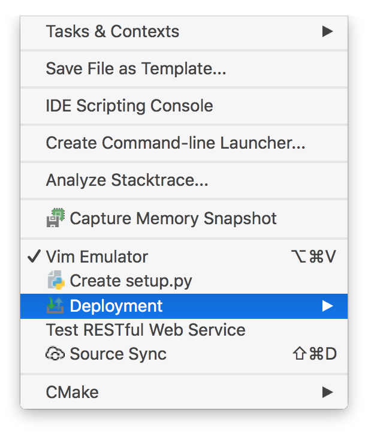
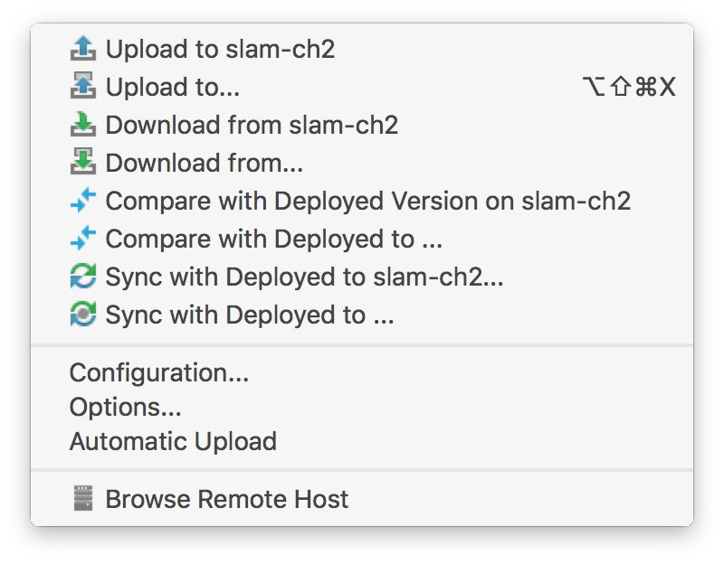
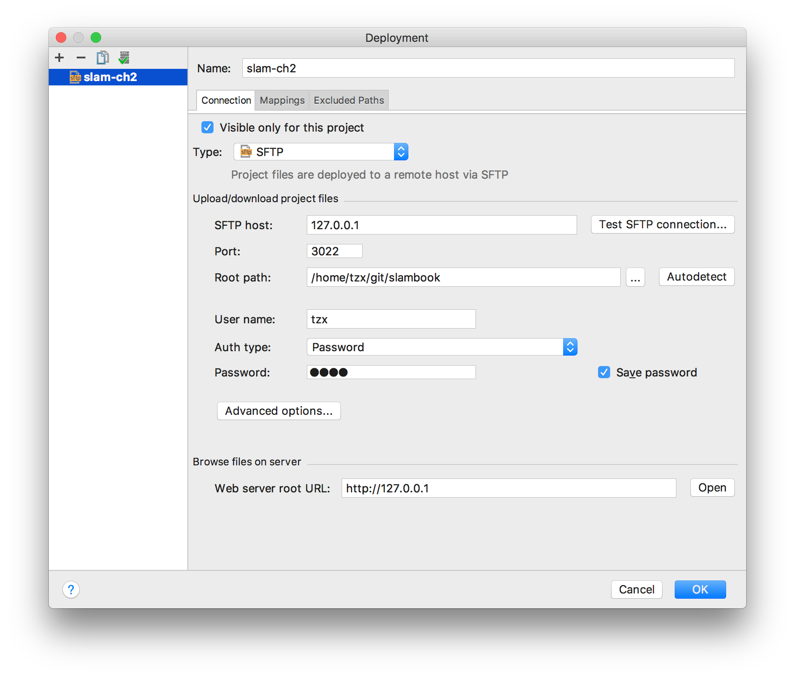
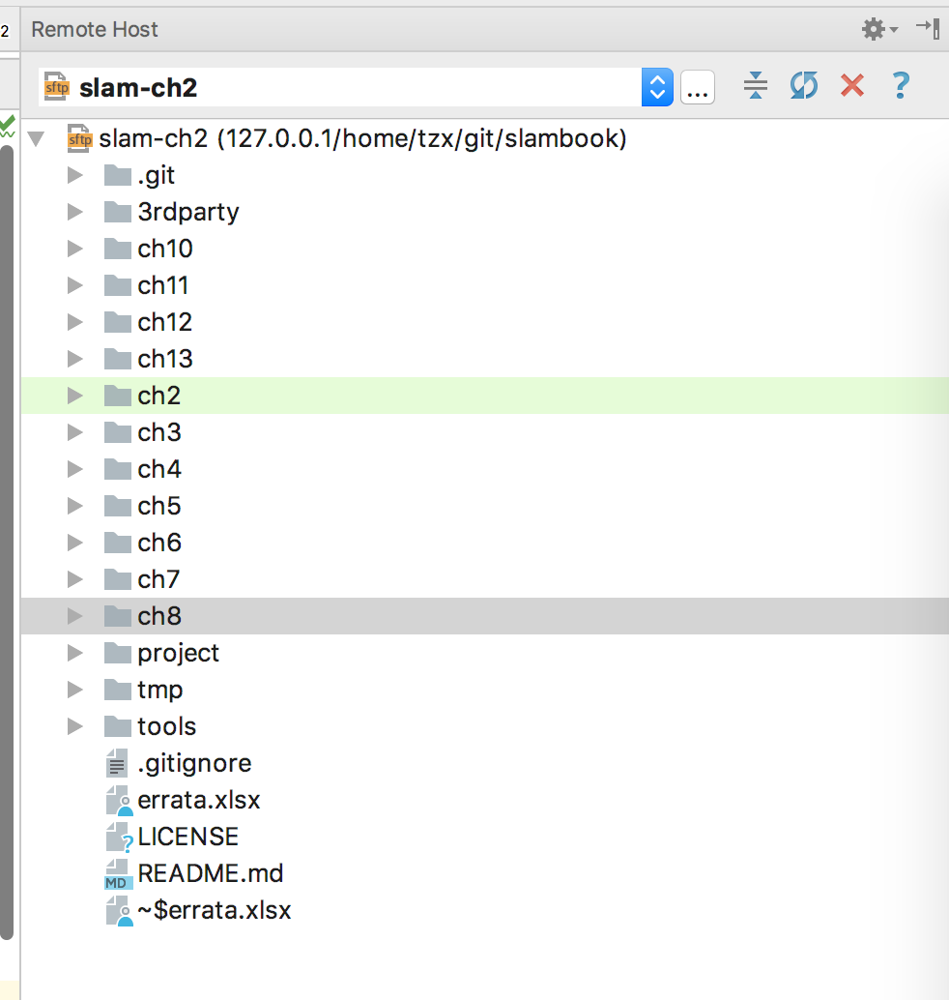
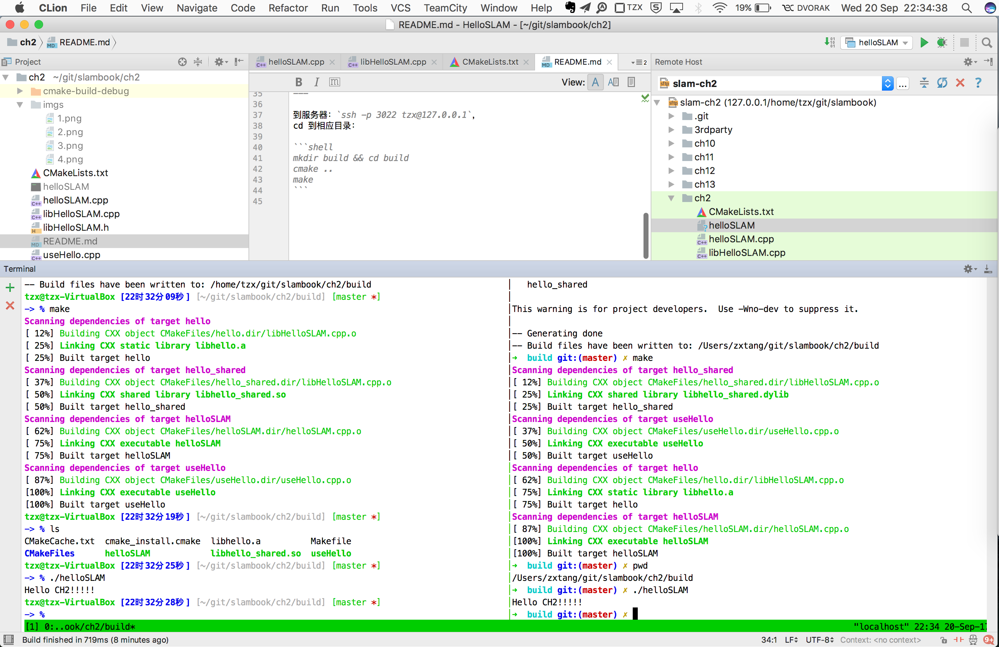

# Setup CLion Remote Deployment

## Make sure you can `ssh` into your remote server

我用 virtualbox 虚拟机安装了 ubuntu 16.04，里面安装了
openssh。然后端口映射出来 22 -> 3022。
这样，我就能通过 `ssh -p 3022 tzx@127.0.0.1` 来访问
这台服务器。

下面我希望自己本地的 C++ 代码能够及时同步到这台 Ubuntu 上，
好运行测试。（macOS 安装各种库依赖太麻烦）

使用 CLion 自带的 Remote host 功能，配置的时候用 SFTP 协议即可。

## Tools -- Deployment -- Edit Configurations







---

这个程序在 macOS 上是无压力的。编辑完了之后，同步到服务器：

Command+Alt+Shift+X：choose server to upload to，然后选择好。

通过 Command+Shift+A，Remote host，可以看到自己同步的记录：



标记绿色说明是刚更新的。

---

到服务器：`ssh -p 3022 tzx@127.0.0.1`，
cd 到相应目录：

```shell
mkdir build && cd build
cmake ..
make
./helloSLAM
```



上图，下面的 terminal，左侧是我的 ubuntu，右侧是本地 macOS。通常我会把 oh-my-zsh 换成不同的 theme，
这样就能一眼区分自己是在服务器还是在本地。
