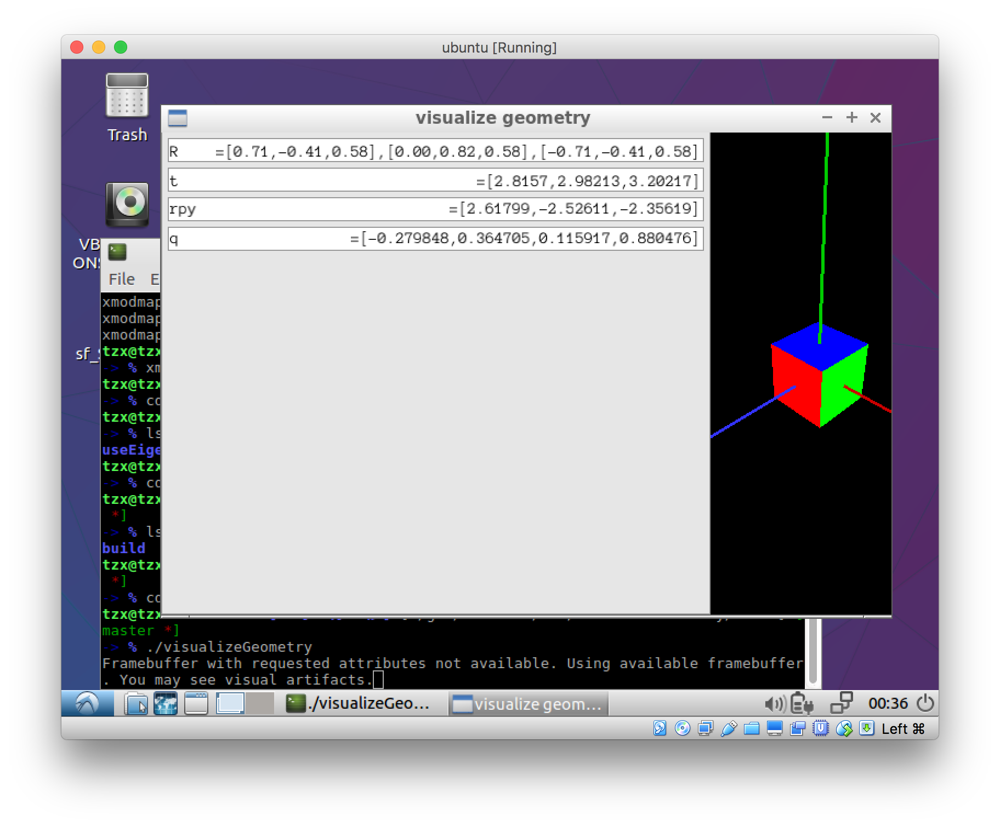

## 如何在 CLion 里面配置库？

Ubuntu: `sudo apt-get install libeigen3-dev`

虽然你的 ubuntu 里面可以编译运行。CLion 里面不能跳转，IDE 就没有意义了。
所以我们要给 CLion 加上 library。

我还没有找到好的方法，现在只能通过把 eigen 头文件下载，然后给CMakeLists 加上
`include_directories(/Users/zxtang/dev/libs/eigen-eigen-5a0156e40feb)` 的方法来
实现。

Eigen 很多东西都是通过宏来拼出来的：

```cpp
#define EIGEN_MAKE_FIXED_TYPEDEFS(Type, TypeSuffix, Size)         \
/** \ingroup matrixtypedefs */                                    \
typedef Matrix<Type, Size, Dynamic> Matrix##Size##X##TypeSuffix;  \
/** \ingroup matrixtypedefs */                                    \
typedef Matrix<Type, Dynamic, Size> Matrix##X##Size##TypeSuffix;

#define EIGEN_MAKE_TYPEDEFS_ALL_SIZES(Type, TypeSuffix) \
EIGEN_MAKE_TYPEDEFS(Type, TypeSuffix, 2, 2) \
EIGEN_MAKE_TYPEDEFS(Type, TypeSuffix, 3, 3) \
EIGEN_MAKE_TYPEDEFS(Type, TypeSuffix, 4, 4) \
EIGEN_MAKE_TYPEDEFS(Type, TypeSuffix, Dynamic, X) \
EIGEN_MAKE_FIXED_TYPEDEFS(Type, TypeSuffix, 2) \
EIGEN_MAKE_FIXED_TYPEDEFS(Type, TypeSuffix, 3) \
EIGEN_MAKE_FIXED_TYPEDEFS(Type, TypeSuffix, 4)

EIGEN_MAKE_TYPEDEFS_ALL_SIZES(int,                  i)
EIGEN_MAKE_TYPEDEFS_ALL_SIZES(float,                f)
EIGEN_MAKE_TYPEDEFS_ALL_SIZES(double,               d)
EIGEN_MAKE_TYPEDEFS_ALL_SIZES(std::complex<float>,  cf)
EIGEN_MAKE_TYPEDEFS_ALL_SIZES(std::complex<double>, cd)
```

这就实现来很多常用的矩阵类型。

useEigen:

```cpp
// Eigen 中所有向量和矩阵都是Eigen::Matrix，它是一个模板类。它的前三个参数为：数据类型，行，列
// 声明一个2*3的float矩阵
Eigen::Matrix<float, 2, 3> matrix_23;

// 同时，Eigen 通过 typedef 提供了许多内置类型，不过底层仍是Eigen::Matrix
// 例如 Vector3d 实质上是 Eigen::Matrix<double, 3, 1>，即三维向量
Eigen::Vector3d v_3d;
Eigen::Vector3f v_3f;
// 这是一样的，但是是 float 型
Eigen::Matrix<float, 3, 1> vd_3d;

// Matrix3d 实质上是 Eigen::Matrix<double, 3, 3>
Eigen::Matrix3d matrix_33 = Eigen::Matrix3d::Zero(); //初始化为零
// 如果不确定矩阵大小，可以使用动态大小的矩阵
Eigen::Matrix<double, Eigen::Dynamic, Eigen::Dynamic> matrix_dynamic;
// 更简单的
Eigen::MatrixXd matrix_x;
// 这种类型还有很多，我们不一一列举

// 下面是对Eigen阵的操作
// 输入数据（初始化）
matrix_23 << 1, 2, 3, 4, 5, 6;
// 输出
cout << matrix_23 << endl;

// 用()访问矩阵中的元素
for (int i = 0; i < 2; i++) {
    for (int j = 0; j < 3; j++)
        cout << matrix_23(i, j) << "\t";
    cout << endl;
}

// 矩阵和向量相乘（实际上仍是矩阵和矩阵）
v_3d << 3, 2, 1;
vd_3d << 4, 5, 6;
// 但是在Eigen里你不能混合两种不同类型的矩阵，像这样是错的
// Eigen::Matrix<double, 2, 1> result_wrong_type = matrix_23 * v_3d;
// 应该显式转换
Eigen::Matrix<double, 2, 1> result = matrix_23.cast<double>() * v_3d;
cout << result << endl;

Eigen::Matrix<float, 2, 1> result2 = matrix_23 * vd_3d;
cout << result2 << endl;

// 同样你不能搞错矩阵的维度
// 试着取消下面的注释，看看Eigen会报什么错
// Eigen::Matrix<double, 2, 3> result_wrong_dimension = matrix_23.cast<double>() * v_3d;

// 一些矩阵运算
// 四则运算就不演示了，直接用+-*/即可。
matrix_33 = Eigen::Matrix3d::Random();      // 随机数矩阵
cout << matrix_33 << endl << endl;

cout << matrix_33.transpose() << endl;      // 转置
cout << matrix_33.sum() << endl;            // 各元素和
cout << matrix_33.trace() << endl;          // 迹
cout << 10 * matrix_33 << endl;               // 数乘
cout << matrix_33.inverse() << endl;        // 逆
cout << matrix_33.determinant() << endl;    // 行列式

// 特征值
// 实对称矩阵可以保证对角化成功
Eigen::SelfAdjointEigenSolver <Eigen::Matrix3d> eigen_solver(matrix_33.transpose() * matrix_33);
cout << "Eigen values = \n" << eigen_solver.eigenvalues() << endl;
cout << "Eigen vectors = \n" << eigen_solver.eigenvectors() << endl;

// 解方程
// 我们求解 matrix_NN * x = v_Nd 这个方程
// N的大小在前边的宏里定义，它由随机数生成
// 直接求逆自然是最直接的，但是求逆运算量大

Eigen::Matrix<double, MATRIX_SIZE, MATRIX_SIZE> matrix_NN;
matrix_NN = Eigen::MatrixXd::Random(MATRIX_SIZE, MATRIX_SIZE);
Eigen::Matrix<double, MATRIX_SIZE, 1> v_Nd;
v_Nd = Eigen::MatrixXd::Random(MATRIX_SIZE, 1);

clock_t time_stt = clock(); // 计时
// 直接求逆
Eigen::Matrix<double, MATRIX_SIZE, 1> x = matrix_NN.inverse() * v_Nd;
cout << "time use in normal inverse is " << 1000 * (clock() - time_stt) / (double) CLOCKS_PER_SEC << "ms" << endl;

// 通常用矩阵分解来求，例如QR分解，速度会快很多
time_stt = clock();
x = matrix_NN.colPivHouseholderQr().solve(v_Nd);
cout << "time use in Qr decomposition is " << 1000 * (clock() - time_stt) / (double) CLOCKS_PER_SEC << "ms" << endl;
```

output:

```bash
$ ./eigenMatrix
1 2 3
4 5 6

1       2       3
4       5       6
10
28
32
77
 0.680375   0.59688 -0.329554
-0.211234  0.823295  0.536459
 0.566198 -0.604897 -0.444451

 0.680375 -0.211234  0.566198
  0.59688  0.823295 -0.604897
-0.329554  0.536459 -0.444451
1.61307
1.05922
 6.80375   5.9688 -3.29554
-2.11234  8.23295  5.36459
 5.66198 -6.04897 -4.44451
-0.198521   2.22739    2.8357
  1.00605 -0.555135  -1.41603
 -1.62213   3.59308   3.28973
0.208598
Eigen values =
0.0242899
 0.992154
  1.80558
Eigen vectors =
-0.549013 -0.735943  0.396198
 0.253452 -0.598296 -0.760134
-0.796459  0.316906 -0.514998
time use in normal inverse is 4.359ms
time use in Qr decomposition is 0.089ms
```

useGeometry:

```
rotation matrix =
 0.707 -0.707      0
 0.707  0.707      0
     0      0      1
(1,0,0) after rotation = 0.707 0.707     0
(1,0,0) after rotation = 0.707 0.707     0
yaw pitch roll = 0.785    -0     0
Transform matrix =
 0.707 -0.707      0      1
 0.707  0.707      0      3
     0      0      1      4
     0      0      0      1
v tranformed = 1.71 3.71    4
quaternion =
    0
    0
0.383
0.924
quaternion =
    0
    0
0.383
0.924
(1,0,0) after rotation = 0.707 0.707     0
```



visualizeGeometry:

```bash
sudo apt install freeglut3-dev
sudo apt-get install libgl1-mesa-dev
sudo apt-get install libglew-dev

git clone https://github.com/stevenlovegrove/Pangolin.git
cd Pangolin
mkdir build && cd build
cmake ..
make -j4
cmake ..
```